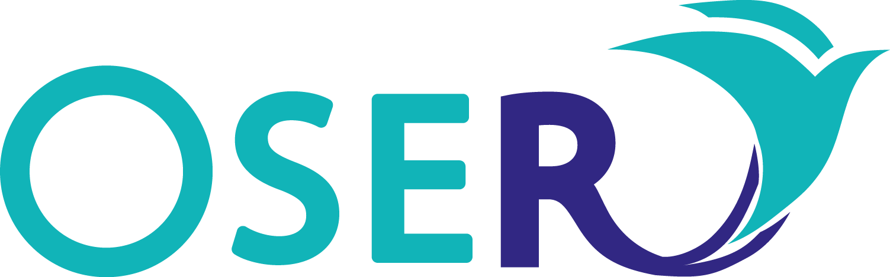
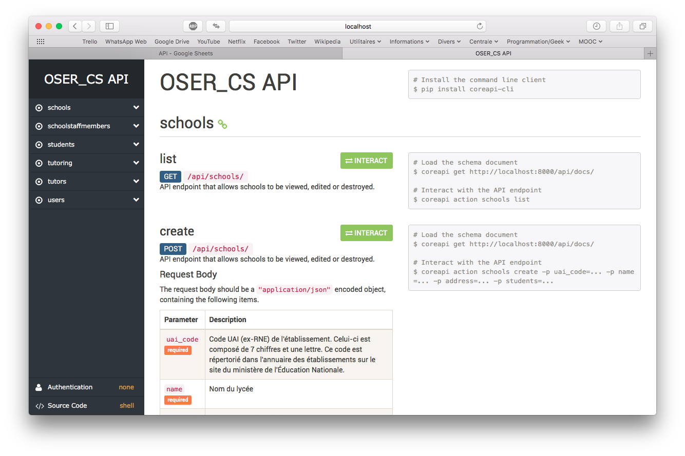

# Site internet d'OSER

<!-- Badges issus de Shields.io.

Les badges sont générés à partir de l'URL, qui ressemble à ceci :
https://img.shields.io/badge/<label>-<status>-couleur>.svg

Plus d'informations sur leur site : http://shields.io
-->

Bienvenue ! Ce dépôt est le lieu de développement du site internet de l'association OSER. Ce site a pour objectif de soutenir l'association dans son action quotidienne.

Si vous venez d'arriver, vous trouverez ci-dessous les ressources pour bien démarrer.

De nombreuses informations sont également disponibles sur le [Wiki](https://github.com/oser-cs/oser-website/wiki). Il est écrit avec amour, allez y faire un tour à l'occasion. :wink:

*Happy coding* !

## Table des matières

- [Dépendances](#dépendances)
- [Installation](#installation)
- [Documentation](#documentation)
- [Contribuer](#contribuer)
- [À propos d'OSER](#À-propos-doser)

## Dépendances

:construction: Section en construction.

> Lister ici les frameworks, packages et autres technos sur lesquelles le projet s'appuie. Pour chaque dépendance, indiquer :
> - la version utilisée ;
> - pour quoi la dépendance est utilisée ;
> -  comment l'installer (instructions ou lien vers une ressource externe).

### Backend

#### Django

[Django](https://www.djangoproject.com) est un framework de développement web pour Python.

Le site d'OSER utilise Django en version 2.0.

> À l'heure actuelle, peu de tutoriels Django se basent sur la version 2.0, mais il y a en fait très peu de changements non-rétro-compatibles par rapport à la version 1.11, et aucun changement n'est réellement critique. Les améliorations apportées par la version 2.0 sont intéressantes, on peut notamment citer le système d'écriture des URLs qui est grandement simplifié. Pour plus d'infos, lire la [release news](https://www.djangoproject.com/weblog/2017/dec/02/django-20-released/) associée.

#### Django REST Framework

Le [Django REST Framework](http://www.django-rest-framework.org) (DRF) permet d'écrire facilement des API REST avec Django.

Le site d'OSER utilise le DRF en version 3.7.3. Cette version est entièrement compatible avec Django 2.0.

#### DRY Rest Permissions

[DRY Rest Permissions](https://github.com/dbkaplan/dry-rest-permissions) est utilisé pour définir les permissions directement sur les modèles Django.

#### FactoryBoy

[FactoryBoy](http://factoryboy.readthedocs.io/en/latest/index.html) est utilisé pour faciliter la création d'objets de test en définissant des usines (*factories*) directement à partir des modèles Django. Les usines sont définies dans `oser_cs/tests/factory.py`.

## Documentation

La documentation du site est hébergée sur [ReadTheDocs](http://oser-website.readthedocs.io/fr/latest/).

### Backend

#### Structure des données

TODO

#### Documentation de l'API

Elle est accessible à l'endpoint `/api/docs/`. Sur le serveur local, vous pouvez donc y accéder à l'URL [`http://localhost:8000/api/docs`](http://localhost:8000/api/docs).

## Contribuer

Le backlog est recensé sur le [Trello OSER_Geek](https://trello.com/b/bYlju4gE/site-internet-backlog).

:construction: Section en construction.

### Pratiques de test

- Dès que vous corrigez un bug, pensez à écrire un test de non-régression (qui permettra de s'assurer que le bug n'arrive plus).
- Tout élément de *business logic* doit être testé par un test fonctionnel.

#### Test de l'API

- Les tests de l'API sont définis dans le package `tests/test_api`.
- Tous les endpoints d'une ressource doivent être testés par un test fonctionnel qui envoie la requête et s'assure que le `status_code` est celui attendu.
- Les permissions d'un endpoint doivent être testées par un test fonctionnel également.
- Un template de cas de test de ressource basée sur un modèle est proposé dans `tests/test_api/model_api_boilerplate.py`.

### Frontend

#### Configuration

https://stanko.github.io/webpack-babel-react-revisited/

## À propos d'OSER

OSER, ou Ouverture Sociale pour la Réussite, est une association étudiante de CentraleSupélec œuvrant dans le cadre des Cordées de la Réussite. Elle accompagne des jeunes issus de tous milieux sociaux et leur propose à cet effet un programme de tutorat, des sorties culturels, des séjours thématiques ou encore des stages de découverte.
