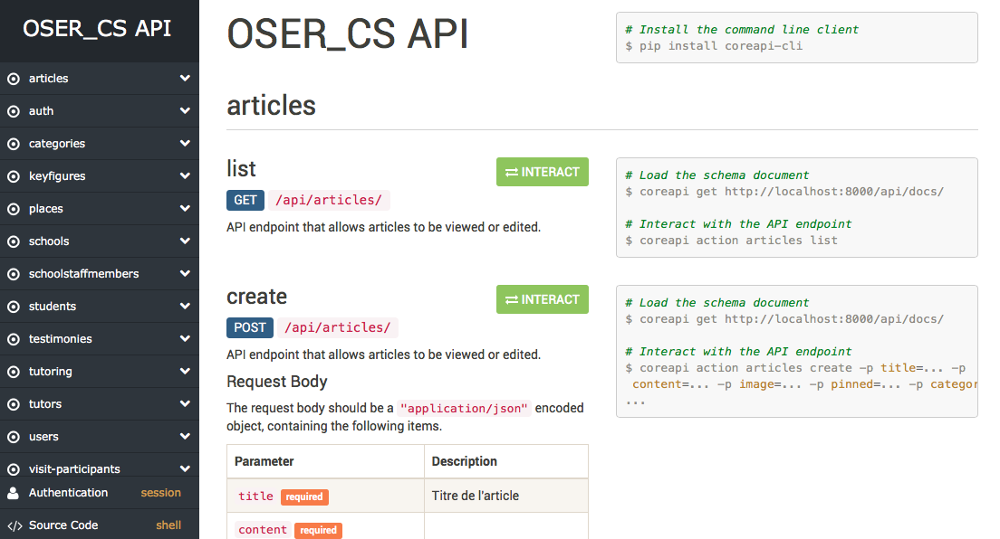

# Site internet d'OSER - Backend

<!-- Badges issus de Shields.io.

Les badges sont générés à partir de l'URL, qui ressemble à ceci :
https://img.shields.io/badge/<label>-<status>-couleur>.svg

Plus d'informations sur leur site : http://shields.io
-->

Bienvenue ! Ce dépôt est le lieu de développement du backend du site internet de l'association OSER, site site a pour objectif de soutenir l'association dans son action quotidienne.

Si vous venez d'arriver, vous trouverez ci-dessous les ressources pour bien démarrer. :+1:

*Happy coding* !

## Table des matières

- [Documentation](#documentation)
- [Dépendances](#dépendances)
- [Contribuer](#contribuer)
- [À propos d'OSER](#À-propos-doser)

## Documentation

La documentation complète du backend est hébergée sur [ReadTheDocs](http://oser-website.readthedocs.io/fr/latest/).

En supplément, la documentation de l'API générée par Django est accessible à l'endpoint `/api/docs/`. Sur le serveur local, vous pouvez donc y accéder à l'URL [`http://localhost:8000/api/docs`](http://localhost:8000/api/docs). Vous pouvez aussi librement parcourir l'API à l'adresse [`http://localhost:8000/api/`](http://localhost:8000/api/).

#### Structure des données

TODO

## Dépendances

:construction: Section en construction.

### Django

[Django](https://www.djangoproject.com) est un framework de développement web pour Python.

Le site d'OSER utilise Django en version 2.0.

> À l'heure actuelle, peu de tutoriels Django se basent sur la version 2.0, mais il y a en fait très peu de changements non-rétro-compatibles par rapport à la version 1.11, et aucun changement n'est réellement critique. Les améliorations apportées par la version 2.0 sont intéressantes, on peut notamment citer le système d'écriture des URLs qui est grandement simplifié. Pour plus d'infos, lire la [release news](https://www.djangoproject.com/weblog/2017/dec/02/django-20-released/) associée.

### Django REST Framework

Le [Django REST Framework](http://www.django-rest-framework.org) (DRF) permet d'écrire facilement des API REST avec Django.

Le site d'OSER utilise le DRF en version 3.7.3. Cette version est entièrement compatible avec Django 2.0.

## Contribuer

Le backlog est recensé sur le [Trello OSER_Geek](https://trello.com/b/bYlju4gE/site-internet-backlog).

Consultez le guide du développeur de la [documentation backend](http://localhost:8000/index.html) pour plus d'informations sur le développement du site.

## À propos d'OSER

OSER, ou Ouverture Sociale pour la Réussite, est une association étudiante de CentraleSupélec œuvrant dans le cadre des Cordées de la Réussite. Elle accompagne des jeunes issus de tous milieux sociaux et leur propose à cet effet un programme de tutorat, des sorties culturels, des séjours thématiques ou encore des stages de découverte.
