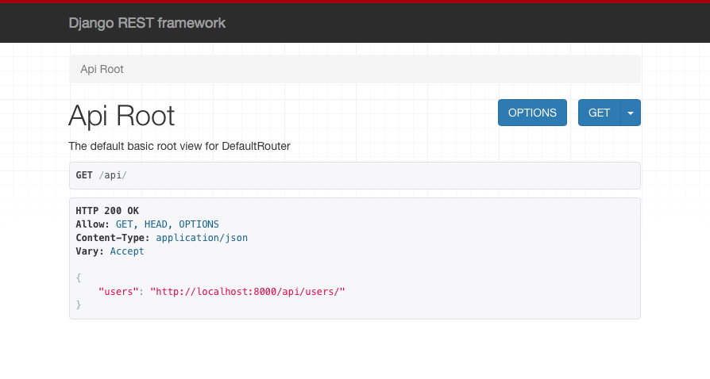

============
Installation
============

Cette page vous indique étape par étape comme installer l'environnement de développement du backend du site. À la fin de ce processus, vous aurez un backend local fonctionnel !

Prérequis
=========

Vous aurez besoin de `Git <https://git-scm.com>`_ pour cloner le dépôt.

Le backend du site repose sur Django et donc Python. Munissez-vous de `Python 3.5+ <https://www.python.org/downloads/>`_ et de `virtualenv <https://pypi.python.org/pypi/virtualenv>`_ si ce n'est pas encore fait. Vous pouvez aussi consulter la page :doc:`ressources-apprentissage/dev-python` pour plus d'informations sur l'installation et l'utilisation de ``virtualenv``.

Installation des dépendances
============================

Tout d'abord, clonez le dépôt sur votre ordinateur :
::
  $ git clone https://github.com/oser-cs/oser-backend.git
  $ cd oser-backend

Créez ensuite un environnement virtuel (ici appelé ``env``) puis activez-le :
::
  oser-backend $ virtualenv env -p python 3
  oser-backend $ source env/bin/activate

Installez les dépendances Python en utilisant ``pip`` :
::
  (env) oser-backend $ pip install -r requirements.txt

Configuration de la base de données
===================================

Tout d'abord, créez puis exécutez les migrations Django :
::
  (env) oser-backend $ cd oser_backend
  (env) oser_backend $ python manage.py makemigrations
  (env) oser_backend $ python manage.py migrate

Lancez les tests pour vous assurer que tout fonctionne comme prévu :
::
  (env) oser_backend $ python manage.py test

Optionnel : vous pouvez peupler la BDD de développement avec de "fausses données" en utilisant la commande ``populatedb`` :
::
  (env) oser_backend $ python manage.py populatedb

Démarrage du site en mode développement
=======================================

Vous en fait avez besoin de démarrer deux serveurs : le serveur backend avec Django et le serveur frontend avec npm (le second communicant avec le premier via l'API).

Démarrez le serveur local Django avec la commande ``runserver`` :
::
  (env) oser_backend $ python manage.py runserver

Si vous vous rendez à l'adresse `http://localhost:8000/api/ <http://localhost:8000/api/>`_, vous devriez arriver à la racine de l'API comme ci-dessous. Si c'est le cas, le serveur Django est fonctionnel ! 👍

Détail des dépendances
======================

.. _Django : https://www.djangoproject.com
.. _release news: https://www.djangoproject.com/weblog/2017/dec/02/django-20-released/)
.. _Django REST Framework : http://www.django-rest-framework.org
.. _DRY Rest Permissions : https://github.com/dbkaplan/dry-rest-permissions
.. _FactoryBoy : http://factoryboy.readthedocs.io/en/latest/index.html

Django
******

Django_ est un framework de développement web pour Python.

Le site d'OSER utilise Django en version 2.0.

> À l'heure actuelle, peu de tutoriels Django se basent sur la version 2.0, mais il y a en fait très peu de changements non-rétro-compatibles par rapport à la version 1.11, et aucun changement n'est réellement critique. Les améliorations apportées par la version 2.0 sont intéressantes, on peut notamment citer le système d'écriture des URLs qui est grandement simplifié. Pour plus d'infos, lire la `release news`_ associée.

Django REST Framework
*********************

Le `Django REST Framework`_ (DRF) permet d'écrire facilement des API REST avec Django.

Le site d'OSER utilise le DRF en version 3.7.3. Cette version est entièrement compatible avec Django 2.0.

DRY Rest Permissions
********************

`DRY Rest Permissions`_ est utilisé pour définir les permissions directement sur les modèles Django.

FactoryBoy
**********

`FactoryBoy`_ est utilisé pour faciliter la création d'objets de test en définissant des usines (*factories*) directement à partir des modèles Django. Les usines sont définies dans ``oser_backend/tests/factory.py``.
