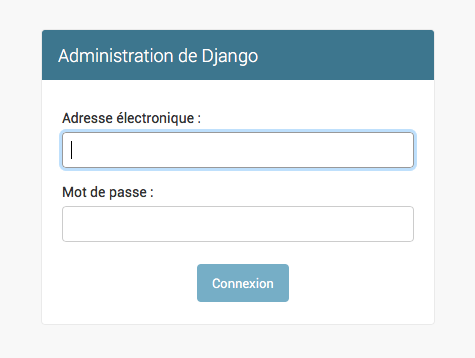
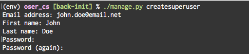
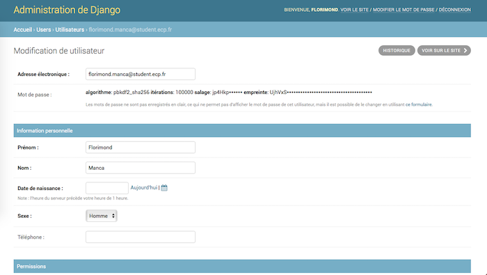
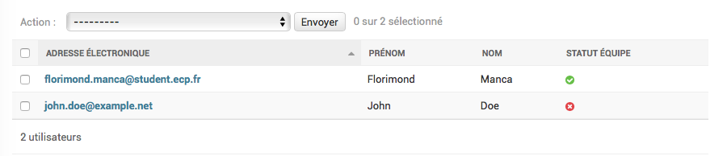

# Utilisateur personnalisé

Le système d'authentification par défaut de Django identifie les utilisateurs par leur nom d'utilisateur, `username`, et leur mot de passe, `password`. On souhaite que les utilisateurs s'identifient par leur adresse mail.

On souhaite également ajouter quelques autres informations à l'utilisateur, comme le sexe ou le numéro de téléphone.

Il a donc fallu procéder à quelques ajustements du système d'authentification fourni par Django :

- Personnalisation du modèle d'utilisateur
- Personnalisation du gestionnaire d'utilisateurs
- Personnalisation du site d'administration


## Personnalisation du modèle d'utilisateur

### Authentification par email

Pour permettre l'authentification par email, l'email de chaque utilisateur doit être défini et unique. On a donc défini un modèle `User` personnalisé (voir [Substituting a custom User model](https://docs.djangoproject.com/en/2.0/topics/auth/customizing/#substituting-a-custom-user-model)). Ci-dessous la partie du code source qui concerne l'authentification par email :

```python
@modify_fields(
    username={'blank': True, '_unique': False, 'null': True},
    email={'_unique': True, 'blank': False, 'null': False},
    ...
)
class User(AbstractUser):
    USERNAME_FIELD = 'email'
    REQUIRED_FIELDS = ['username', 'first_name', 'last_name']
    ...
```

Le décorateur `@modify_fields` est défini dans `oser_cs/utils.py`. Il permet de modifier des attributs de champs d'un modèle définis dans son super-modèle, sans devoir redéclarer les champs par copier-coller du super-modèle. Par exemple, la ligne :

```python
    username={'blank': True, '_unique': False, 'null': True},
```

signifie que dans `User`, le champ `username` peut être vide (`'blank: True'`), peut être nul (`'null: True'`) et n'est plus unique (`'_unique': False`).

L'attribut `USERNAME_FIELD` de la classe `User` signale à Django que l'on utilise maintenant le champ `email` comme champ d'identification. Par défaut, `USERNAME_FIELD` vaut `username`. Concrètement, Django va donc remplacer le champ `username` par le champ `email` partout où il apparaissait avant, notamment dans les formulaires de login. Ci-dessous un exemple avec la page de login du site d'administration qui a été mise à jour sans autre modification de notre part :



Pour plus d'infos sur `USERNAME_FIELD`, voir la [documentation](https://docs.djangoproject.com/en/2.0/topics/auth/customizing/#django.contrib.auth.models.CustomUser.USERNAME_FIELD).

Enfin, l'attribut `REQUIRED_FIELDS` est utilisé par Django lors de la création de super-utilisateurs via `manage.py createsuperuser`. Il définit les champs qui sont demandés en plus des champs d'authentification. On le redéfinit car il vaut par défaut `['email', 'first_name', 'last_name']` : on retire le champ `email` de la liste car il est de toute façon demandé en tant que champ d'authentification.



### Champs supplémentaires

Des champs supplémentaires sont définis sur le modèle `User` personnalisé : date de naissance, sexe et numéro de téléphone.

### URL absolu

On définit également l'URL absolu d'un utilisateur par une redirection à l'endpoint `GET /api/users/<user_id>/` de l'API.

## Personnalisation du gestionnaire d'utilisateurs

On fait ici référence à l'objet `UserManager` qui est associé à `User.objects` et par lequel on effectue des requêtes à l'ORM Django. C'est par cet objet que l'on crée de nouveaux utilisateurs, il a donc fallu l'adapter quelque peu pour rendre obligatoire la fourniture d'une adresse email lors de la création d'un utilisateur (l'argument obligatoire était auparavant le `username`). Il est redéfini par presque copier-coller du `UserManager` défini dans le code source de Django, on n'entrera donc pas plus dans les détails.


## Personnalisation du site d'administration

Le site d'administration de Django génère automatiquement les pages permettant de gérer le modèle `User`. On a personnalisé le `UserAdmin` afin de :

- Supprimer `username` des champs des formulaires (création/édition d'un utilisateur) et réorganiser ceux-ci pour qu'ils intègrent les champs personnalisés



- Supprimer `username` du tableau listant les utilisateurs


